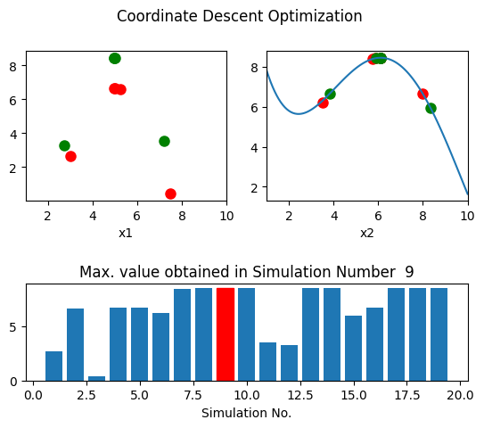

# [**www.tausystems.com**](https://www.tausystems.com)

# TauOpt

A general-purpose automation and optimization code for physics/engineering simulations.

## License
See LICENSE.md for license rights and limitations (Apache2.0).
 
## Getting Started

TauOpt is a Python software designed to execute target codes once correctly configured. TauOpt itself is not a Python package but requires additional Python packages. To use TauOpt, follow these steps: 

1. Download the source code.
2. Install all dependencies listed in the 'requirements.txt' file. 
3. Place the target code in a folder. 
4. Modify the target code as explained below: label the locations where TauOpt will write input parameters. 
5. Prepare a configuration file, as explained below, that defines the interaction properties between TauOpt and the target code. 
6. Run TauOpt using the command 'python TauOpt.py FULL/PATH/OF/CONFIGURATION/FILE/user_config.py'. 

## Preparing the Target Code

Before TauOpt executes the target code, it modifies the source code (e.g., input files) between runs as follows: 

1. Read the files individually, as specified in the configuration file.
2. Find matching strings (variable names a prefix), and replaced them with numerical values.

It then compiles the target code and runs the executable based on the configured settings.

## Writing a Configuration File
The configuration file is a Python script that contains variables, dictionaries, and functions. Together, they shape the behavior of TauOpt and define how it interacts with the target code. For an example, refer to '/examples/test_project/test_config.py'

A complete list of configuration properties can be found in 'src/config/config.py'. Variables, dictionaries, and functions defined in user-provided configuration files override objects with similar names in 'src/config/config.py'. 

## Example
The 'examples' directory includes a subdirectory called 'test_project'. Within this directory, you'll find an example target code named 'test_code', and a simple configuration file 'test_config.py'. 

To proceed, open 'test_config.py' and modify the 'project_folder' variable by providing the full path to the 'test_project/' directory on your local computer. All files and folders produced by TauOpt will be contained within the 'project_folder', i.e., 'test_project/'. To run this test case from the 'TauOpt/' directory, use the following command (update INSTALL_DIR appropriately): 
        
'python TauOpt.py INSTALL_DIR/TauOpt/examples/test_project/test_config.py' 

Plots illustrating the optimization process are saved in the 'opt_plots/' directory. For example:    

